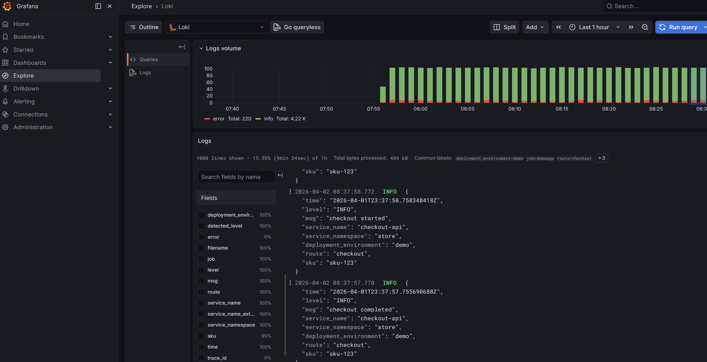
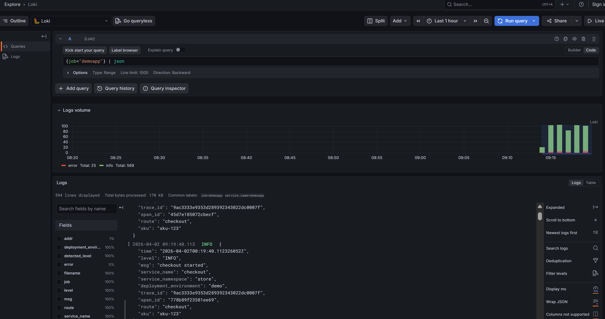
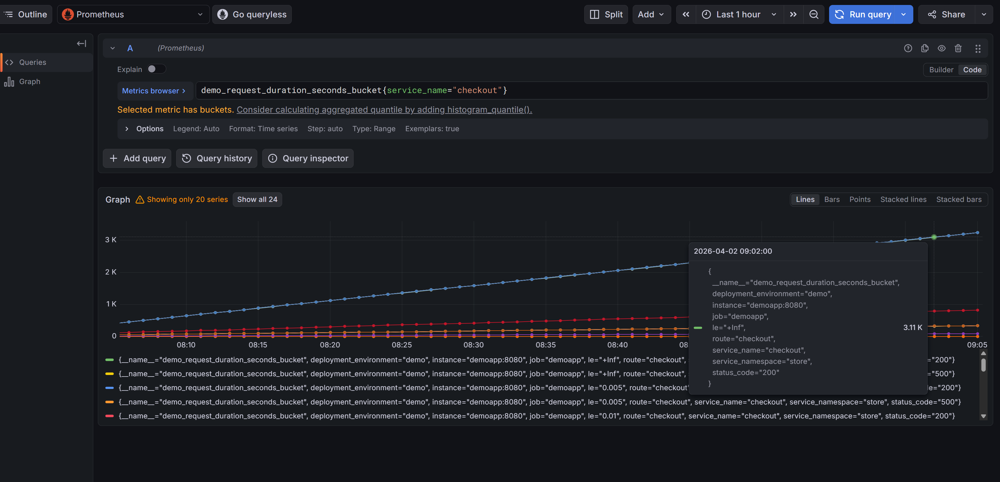
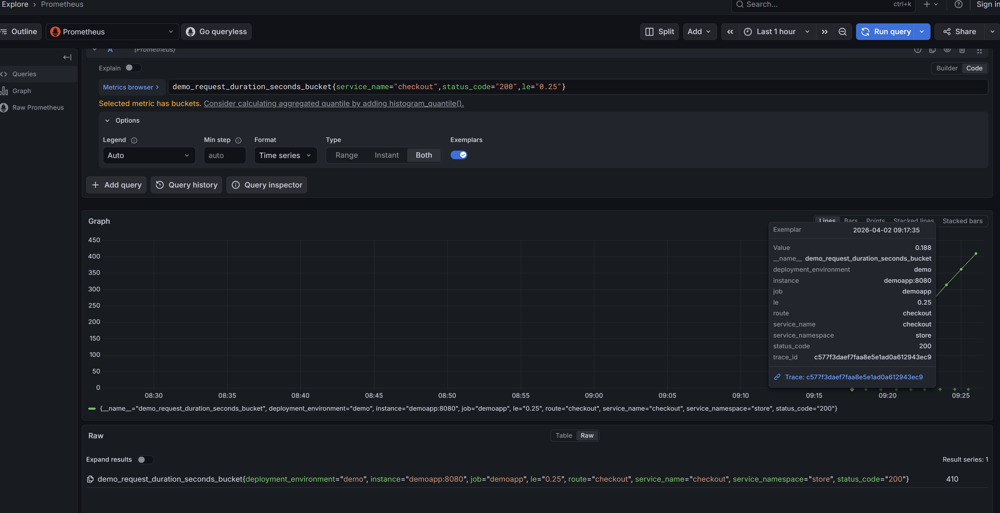

# lgtm-link-scan

`lgtm-link-scan` is a CLI for scoring cross-signal link quality across logs, metrics, and traces in an LGTM stack.

## Status

This repository is still in bootstrap.

- The analyzers are not implemented yet.
- The current deliverables are a local demo environment and a Go CLI scaffold.
- The demo exists to validate the problem shape before the scanner logic is built.

The repository is currently centered around two foundations:

1. A reproducible local demo stack that can intentionally emit both good and bad telemetry.
2. A Go CLI scaffold for the future `doctor`, `scan`, `report`, and `diff` commands.

## Current Scope

- Go CLI/config scaffold that compiles
- Local LGTM demo environment with Grafana Alloy and a sample Go app
- Toggleable `good` and `bad` telemetry modes for validation
- Public preview of broken and healthy cross-signal behavior
- Early project planning intended for GitHub Issues and Projects

## Demo Preview

The bootstrap already reproduces both broken and healthy cross-signal behavior.

Logs in `bad` mode -> logs in `good` mode

<table>
  <tr>
    <td></td>
    <td align="center"><strong>-&gt;</strong><br>missing trace context</td>
    <td></td>
  </tr>
</table>

Metrics in `bad` mode -> metrics in `good` mode

<table>
  <tr>
    <td></td>
    <td align="center"><strong>-&gt;</strong><br>no exemplars to trace-linked exemplars</td>
    <td></td>
  </tr>
</table>

## Optional Demo

If you want to inspect the current behavior locally, bring up the intentionally broken environment:

```bash
make demo-up-bad
```

Then switch to the healthy environment:

```bash
make demo-up-good
```

Open Grafana at `http://localhost:${GRAFANA_PORT:-3000}` and log in with `admin` / `admin`.

The demo app listens on `http://localhost:${APP_PORT:-8080}` and a load generator continuously calls `/checkout`, so telemetry should appear without any extra manual steps.

## Repo Layout

```text
cmd/lgtm-link-scan/              CLI entrypoint
internal/cli/                    Cobra command scaffold
internal/config/                 YAML config loader and validation
examples/docker-compose/         Local LGTM + Alloy + demo app environment
docs/assets/screenshots/         README preview images
```

## Useful Commands

```bash
make build
make test
make doctor
make demo-up-bad
make demo-up-good
make demo-down
```

## Local Endpoints

Defaults:

- Grafana: `http://localhost:3000`
- Demo app: `http://localhost:8080`
- Alloy UI: `http://localhost:12345`
- Loki API: `http://localhost:3100`
- Prometheus-compatible metrics API: `http://localhost:9090`
- Tempo API: `http://localhost:3200`

All host ports can be overridden with shell env vars:
`GRAFANA_PORT`, `PROMETHEUS_PORT`, `LOKI_PORT`, `TEMPO_PORT`, `APP_PORT`, `ALLOY_UI_PORT`, `OTLP_GRPC_PORT`, `OTLP_HTTP_PORT`.
